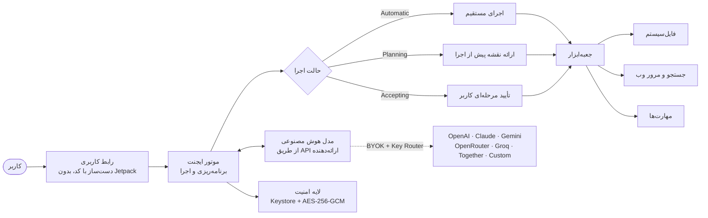
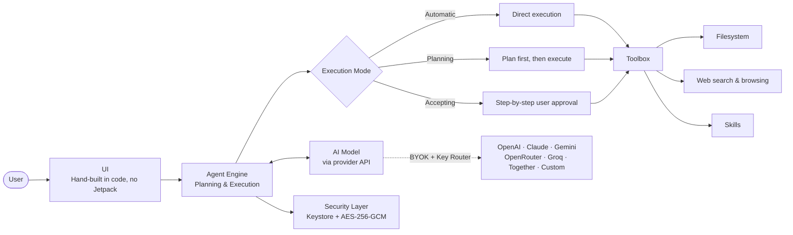

<div align="center">

# ⚡ Vega Agent

**ایجنت هوش مصنوعی قدرتمند، قابل‌کنترل و متن‌باز برای اندروید**

*مدیریت فایل · تحقیق در وب · ویرایش کد · اجرای وظایف چندمرحله‌ای — همه روی دستگاه خودتان*

**A powerful, controllable, open-source AI agent for Android**

*File management · Web research · Code editing · Multi-step tasks — all on your own device*

<br>

[](https://www.android.com/)
[](https://kotlinlang.org/)
[](#-معماری)
[](#-امنیت)
[](#-نصب)
[](LICENSE)

<br>

[](https://github.com/Vegxz/Vega-Agent/releases/latest)
[](https://github.com/Vegxz/Vega-Agent/releases)
[](https://github.com/Vegxz/Vega-Agent/actions)
[](https://github.com/Vegxz/Vega-Agent/stargazers)
[](https://github.com/Vegxz/Vega-Agent/issues)

<br>

**[🇮🇷 فارسی](#-فارسی)** · **[🇬🇧 English](#-english)** · [📸 تصاویر](#-screenshots) · [🗺️ فهرست](#-فهرست-مطالب--table-of-contents) · [📥 نصب](#-نصب)

</div>

---

<div align="center">

### چرا وگا ایجنت؟

### Why Vega Agent?

| | |
| :--- | :--- |
| 🧠 | **یک ایجنت واقعی، نه فقط یک چت‌بات** — برنامه‌ریزی می‌کند، ابزارها را فراخوانی می‌کند، فایل‌ها را می‌خواند و ویرایش می‌کند و وظایف چندمرحله‌ای را تا انتها اجرا می‌کند |
| 🧱 | **بدون هیچ وابستگی خارجی** — رابط کاملاً دست‌ساز با کد؛ بدون Jetpack و بدون کتابخانه شخص ثالث. فقط فریم‌ورک اندروید و کتابخانه استاندارد کاتلین: سبک، سریع و شفاف |
| 🔑 | **کلید API خودتان (BYOK) + مسیریاب کلید** — تا ۵۰ کلید با چرخش خودکار هنگام محدودیت نرخ؛ بدون اشتراک، بدون سرور واسط |
| 🧩 | **مهارت‌های ایجنت (Skills)** — از لینک گیت‌هاب نصب کنید؛ ایجنت خودش مهارت مناسب هر وظیفه را انتخاب می‌کند |
| 🛡️ | **کنترل کامل روی استقلال ایجنت** — سه حالت Automatic، Planning و Accepting؛ شما تصمیم می‌گیرید چه زمانی تأیید لازم است |
| 🔒 | **حریم خصوصی در اولویت** — معماری Local-First؛ کلیدها در Android Keystore و داده‌های حساس با AES-256-GCM روی دستگاه شما رمزنگاری می‌شوند |
| 🌍 | **کاملاً دوزبانه** — رابط فارسی راست‌به‌چپ و انگلیسی چپ‌به‌راست، با آینه‌سازی کامل چیدمان |
| 🆓 | **متن‌باز واقعی (AGPL-3.0)** — سورس کامل در دسترس است؛ تغییر دهید، بهبود دهید و با همان آزادی منتشر کنید |

</div>

---

<a id="-screenshots"></a>

## 📸 Screenshots · تصاویر برنامه

<div align="center">

| 📂 مدیریت فایل | 🛡️ حالت اجرای ایجنت | ⚙️ تنظیمات ارائه‌دهنده |
| :---: | :---: | :---: |
|  |  |  |
| انتخاب فایل‌ها و پوشه‌ها برای کار ایجنت | خودکار، برنامه‌ریزی یا تأیید مرحله‌ای | پشتیبانی از چندین ارائه‌دهنده و مدل |

| 🧠 تنظیم استدلال | 🔍 جزئیات اجرا | 🌐 جستجو و مرور وب |
| :---: | :---: | :---: |
|  |  |  |
| تنظیم توان پردازش از کم تا حداکثر | مشاهده وضعیت مراحل و فراخوانی ابزارها | تحقیق و دریافت اطلاعات زنده از وب |

</div>

---

<a id="-فهرست-مطالب--table-of-contents"></a>

## 🗺️ فهرست مطالب · Table of Contents

| 🇮🇷 فارسی | 🇬🇧 English |
| :--- | :--- |
| [معرفی](#-فارسی) | [Overview](#-english) |
| [معماری](#-معماری) | [Architecture](#-architecture) |
| [قابلیت‌های اصلی](#-قابلیتها) | [Core Capabilities](#-capabilities) |
| [ارائه‌دهنده‌ها](#-ارائهدهندهها) | [AI Providers](#-providers) |
| [مسیریاب کلید](#-کلیدها) | [Key Router](#-keyrouter) |
| [مهارت‌های ایجنت](#-مهارتها) | [Agent Skills](#-skills) |
| [ابزارهای فایل‌سیستم](#-فایلها) | [Filesystem Tools](#-filesystem) |
| [حالت‌های اجرای ایجنت](#-حالتها) | [Execution Modes](#-modes) |
| [استدلال و گردش کار پویا](#-استدلال) | [Reasoning & Workflows](#-reasoning) |
| [جستجو و مرور وب](#-وب) | [Web Search & Browsing](#-web) |
| [امنیت و حریم خصوصی](#-امنیت) | [Security & Privacy](#-security) |
| [دسترسی‌های برنامه](#-دسترسیها) | [App Permissions](#-permissions) |
| [اجرای پایدار در پس‌زمینه](#-پسپرداختزمینه) | [Background Execution](#-background) |
| [رابط دوزبانه و تایپوگرافی](#-دوزبانه) | [Bilingual UI & Typography](#-i18n) |
| [نصب](#-نصب) | [Installation](#-installation) |
| [سازگاری](#-سازگاری) | [Compatibility](#-compatibility) |
| [ساخت از سورس](#-ساخت) | [Build from Source](#-build) |
| [نکات مهم](#-نکات) | [Important Notes](#-notes) |
| [مشارکت در پروژه](#-مشارکت) | [Contributing](#-contributing) |
| [نقشه راه](#-نقشهراه) | [Roadmap](#-roadmap) |
| [پرسش‌های پرتکرار](#-پرتکرار) | [FAQ](#-faq) |
| [مجوز](#-مجوز) | [License](#-license) |
| [سپاسگزاری‌ها](#-سپاس) | [Acknowledgments](#-acknowledgments) |

---
<a id="-فارسی"></a>

<div dir="rtl">

## 🇮🇷 فارسی

**Vega Agent** نسخه **1.1.0** — یک ایجنت هوش مصنوعی دست‌ساز و **بدون هیچ وابستگی خارجی** برای اندروید (`github.vega.agent`).

کل رابط کاربری با کد نوشته شده است: بدون Jetpack، بدون کتابخانه شخص ثالث — فقط فریم‌ورک اندروید، `org.json` خود پلتفرم و کتابخانه استاندارد کاتلین. نتیجه برنامه‌ای سبک، سریع و کاملاً شفاف است که می‌توانید خط‌به‌خط آن را بررسی کنید.

این برنامه فراتر از یک چت‌بات عمل می‌کند: فایل‌ها را می‌خواند و ویرایش می‌کند، در وب تحقیق می‌کند، کد می‌نویسد، مهارت‌های جدید یاد می‌گیرد و وظایف چندمرحله‌ای را — به‌صورت خودکار یا با نظارت شما — تا انتها اجرا می‌کند.

معماری **Local-First** یعنی رابط کاربری، موتور ایجنت، ابزارهای فایل‌سیستم و ذخیره‌سازی تنظیمات همگی روی دستگاه شما اجرا می‌شوند؛ برای اتصال به مدل‌ها کافی است کلید API ارائه‌دهنده موردنظر خودتان را وارد کنید (**BYOK**).

<a id="-معماری"></a>

### 🏗️ معماری



همه‌چیز روی دستگاه شما اتفاق می‌افتد؛ تنها چیزی که از گوشی خارج می‌شود، درخواست‌هایی است که خودتان به ارائه‌دهنده API انتخاب‌شده می‌فرستید.

<a id="-قابلیتها"></a>

### 🚀 قابلیت‌های اصلی

| | قابلیت | در یک نگاه |
| :---: | :--- | :--- |
| 🤖 | **[ارائه‌دهنده‌های متعدد](#-ارائهدهندهها)** | OpenAI، Claude، Gemini، OpenRouter، Groq، Together و هر endpoint سازگار |
| 🔑 | **[مسیریاب کلید](#-کلیدها)** | تا ۵۰ کلید API با چرخش خودکار هنگام محدودیت نرخ |
| 🧩 | **[مهارت‌های ایجنت](#-مهارتها)** | نصب مهارت از لینک گیت‌هاب؛ انتخاب هوشمندانه توسط ایجنت |
| 📂 | **[ابزارهای فایل‌سیستم](#-فایلها)** | خواندن، نوشتن، ویرایش با پیش‌نمایش، جستجو، ZIP و PDF |
| 🛡️ | **[حالت‌های اجرا](#-حالتها)** | Automatic، Planning و Accepting — سطح استقلال دست شماست |
| 🧠 | **[استدلال قابل‌تنظیم](#-استدلال)** | سطح thinking اختصاصی برای هر ارائه‌دهنده |
| 🌐 | **[جستجو و مرور وب](#-وب)** | DuckDuckGo و Bing، دریافت صفحات، مرور با WebView |
| 📝 | **رندر مارک‌داون** | جدول‌ها، بلوک‌های کد با کارت کد، کپی با یک لمس |
| 💬 | **گفت‌وگوی ایجنت** | پاسخ‌های استریمینگ، تاریخچه گفت‌وگو، تست اتصال |
| 🔒 | **[امنیت و حریم خصوصی](#-امنیت)** | Android Keystore، AES-256-GCM، محافظت در برابر SSRF |
| ⚡ | **[اجرای پس‌زمینه](#-پسپرداختزمینه)** | Foreground Service با محافظ حلقه کرش |
| 🎨 | **[رابط دوزبانه](#-دوزبانه)** | فارسی راست‌به‌چپ و انگلیسی چپ‌به‌راست با آینه‌سازی کامل |

<a id="-ارائهدهندهها"></a>

#### 🤖 پشتیبانی از ارائه‌دهنده‌های متعدد

| ارائه‌دهنده | نوع | نکته |
| :--- | :--- | :--- |
| `OpenAI` | ابری | پشتیبانی کامل از مدل‌های GPT |
| `Anthropic Claude` | ابری | مدل‌های Claude با پروتکل اختصاصی |
| `Google Gemini` | ابری | مدل‌های Gemini |
| `OpenRouter` | ابری | دسترسی یکپارچه به ده‌ها مدل با یک کلید |
| `Groq` | ابری | استنتاج فوق‌سریع |
| `Together AI` | ابری | مدل‌های متن‌باز میزبانی‌شده |
| `Custom endpoint` | متغیر | هر سرویسی با API سازگار با OpenAI |

[](#-نصب)
[](#-ارائهدهندهها)

> کافی است ارائه‌دهنده را انتخاب کنید و کلید API را وارد کنید؛ برای endpointهای سفارشی، `Base URL` هم قابل تنظیم است. سطح استدلال (thinking) برای هر ارائه‌دهنده جداگانه تنظیم می‌شود.

<a id="-کلیدها"></a>

#### 🔑 مسیریاب کلید (Key Router)

اگر چند کلید API دارید، لازم نیست دستی جابه‌جا شوید:

- تعریف **تا ۵۰ کلید** برای هر ارائه‌دهنده
- **چرخش خودکار** به کلید بعدی هنگام برخورد به محدودیت نرخ (rate limit)
- ادامه بدون وقفه وظایف طولانی، حتی با سهمیه محدود هر کلید

> ایده‌آل برای کارهای سنگین و چندمرحله‌ای که مصرف API بالایی دارند.

<a id="-مهارتها"></a>

#### 🧩 مهارت‌های ایجنت (Agent Skills)

Vega Agent می‌تواند مهارت‌های جدید یاد بگیرد:

1. در تنظیمات، بخش **ابزارها و دسترسی‌ها** → **افزودن مهارت** را باز کنید.
2. لینک یک مخزن گیت‌هاب را وارد کنید.
3. برنامه مخزن را می‌خواند و مدلِ خودِ شما آن را به تعریف‌های مهارت تبدیل می‌کند.
4. مهارت‌ها در پوشه `<پوشه انتخابی>/Vega Skills` ذخیره می‌شوند.
5. از آن به بعد، ایجنت فقط مهارت‌هایی را به کار می‌گیرد که واقعاً به وظیفه جاری مرتبط باشند.

> مهارت‌ها روی دستگاه شما ذخیره می‌شوند و کاملاً تحت کنترل شما هستند؛ هر زمان خواستید می‌توانید آن‌ها را حذف یا جایگزین کنید.

<a id="-فایلها"></a>

#### 📂 ابزارهای واقعی فایل‌سیستم

ابزارهای ایجنت — با اجازه شما:

| ابزار | کار |
| :--- | :--- |
| `read_file` | خواندن محتوای فایل |
| `write_file` | ایجاد فایل جدید |
| `edit_file` | ویرایش دقیق با پیش‌نمایش تغییرات |
| `list_dir` | فهرست پوشه‌ها |
| `search_files` / `glob` | جستجوی متن در فایل‌ها و یافتن فایل با الگو |
| `web_search` / `fetch` | جستجوی وب و دریافت صفحات |
| + | کار با ZIP، استخراج PDF، ویرایش کد |

> سطح دسترسی واقعی به نسخه اندروید، مجوزهای اعطاشده و پوشه‌ای که خودتان انتخاب می‌کنید بستگی دارد. دسترسی‌ها فقط در زمان نیاز و در محدوده‌ای که تعیین می‌کنید فعال می‌شوند.

<a id="-حالتها"></a>

#### 🛡️ حالت‌های اجرای ایجنت

شما تعیین می‌کنید ایجنت چقدر مستقل عمل کند:

| حالت | رفتار | مناسب برای |
| :--- | :--- | :--- |
| ⚙️ **Automatic** (خودکار) | اجرای وظایف بدون تأیید مرحله‌به‌مرحله | کارهای روتین روی فایل‌هایی که نسخه پشتیبان دارند |
| 🗺️ **Planning** (برنامه‌ریزی) | تحلیل درخواست و ارائه نقشه اجرایی، پیش از اعمال هر تغییری | وظایف پیچیده و چندمرحله‌ای |
| ✅ **Accepting** (تاییدی) | دریافت تأیید شما پیش از اجرای اقدامات حساس | ویرایش فایل‌های مهم و عملیات حساس |

> برای شروع، حالت **Accepting** پیشنهاد می‌شود. با تأیید نقشه در حالت Planning، اجرا به‌صورت خودکار به حالت Accepting می‌رود.

<a id="-استدلال"></a>

#### 🧠 استدلال قابل‌تنظیم و گردش کار پویا

بسته به مدل انتخاب‌شده، میزان تلاش استدلال (thinking) را از سطح پایین تا حداکثر تنظیم کنید — برای پاسخ‌های سریع و کم‌هزینه، یا تحلیل عمیق مسائل پیچیده. این تنظیم **برای هر ارائه‌دهنده جداگانه** ذخیره می‌شود.

Vega Agent همچنین می‌تواند:

- ✅ وظایف پیچیده را به مراحل کوچک‌تر و قابل‌مدیریت تقسیم کند
- ✅ چند فعالیت مستقل را به‌صورت موازی اجرا کند (از جمله واگذاری به زیرایجنت‌ها)
- ✅ وضعیت لحظه‌ای مراحل و پیشرفت کار را نمایش دهد
- ✅ فراخوانی ابزارها و نتیجه هر عملیات را شفاف ثبت کند

> قابلیت‌های استدلال و اجرای موازی ممکن است میان مدل‌ها و ارائه‌دهندگان مختلف متفاوت باشند.

<a id="-وب"></a>

#### 🌐 جستجو و مرور وب

ابزارهای وب برنامه:

- 🔍 جستجو از طریق **DuckDuckGo** و **Bing**
- 📄 دریافت و تحلیل محتوای صفحات وب
- 🖥️ مرور تعاملی صفحات با **WebView** اندروید
- 🏠 مدیریت دسترسی به آدرس‌های شبکه محلی
- 👤 تعامل کاربر-محور با صفحاتی که نیاز به ورود یا تأیید مرورگر دارند

> Vega Agent برای دور زدن سازوکارهای امنیتی وب‌سایت‌ها طراحی نشده است. استفاده از قابلیت مرور باید مطابق قوانین و شرایط استفاده هر سرویس انجام شود.

</div>
<div dir="rtl">

<a id="-امنیت"></a>

#### 🔒 امنیت و حریم خصوصی

| لایه | محافظت |
| :--- | :--- |
| 🔑 کلیدهای API | نگهداری امن با **Android Keystore**؛ کلیدها هرگز به‌صورت متن ساده ذخیره نمی‌شوند |
| 🔐 داده‌های ذخیره‌شده | رمزنگاری اطلاعات حساس با **AES-256-GCM** |
| ✅ پیش از هر درخواست | بررسی اولیه (Preflight) تنظیمات و تست اتصال |
| 🚧 شبکه | محدودسازی دسترسی به آدرس‌های داخلی و نقاط پایانی حساس |
| 🛡️ درخواست‌های خروجی | محافظت در برابر سناریوهای شناخته‌شده **SSRF** |
| 👤 اقدامات ایجنت | امکان کنترل و تأیید اقدامات پیش از اجرا (حالت Accepting) |

**مدل تهدید به زبان ساده:** Vega Agent هیچ سرور واسط اختصاصی برای پردازش مکالمات شما ندارد. اما وقتی از مدل‌های ابری استفاده می‌کنید، متن درخواست‌ها و اطلاعاتی که برای پردازش انتخاب می‌کنید مستقیماً به ارائه‌دهنده API شما ارسال می‌شوند — دقیقاً مثل هر کلاینت API دیگری.

<a id="-دسترسیها"></a>

#### 📋 دسترسی‌های برنامه — شفاف و حداقلی

برنامه فقط دسترسی‌هایی را اعلام می‌کند که واقعاً لازم دارد؛ دلیل هر کدام:

| دسترسی | چرا لازم است |
| :--- | :--- |
| 🌐 اینترنت | ارتباط با API ارائه‌دهنده، جستجو و دریافت صفحات وب |
| 📶 وضعیت شبکه | بررسی اتصال پیش از درخواست‌ها |
| ⚙️ سرویس پیش‌زمینه | ادامه وظایف طولانی وقتی برنامه در پس‌زمینه است |
| 🔋 بیدار نگه‌داشتن پردازش | جلوگیری از توقف وظایف طولانی در حالت خواب |
| 🔔 اعلان‌ها | نمایش اعلان سرویس پس‌زمینه و پیشرفت کار |
| 📶 تغییر وضعیت وای‌فای | قفل وای‌فای برای پایداری اتصال حین کارهای طولانی |
| 🔋 معافیت از بهینه‌سازی باتری | فقط با تأیید شما، برای جلوگیری از کشته‌شدن سرویس |
| 📂 مدیریت فایل‌ها | ابزارهای فایل‌سیستم ایجنت (در محدوده‌ای که شما تعیین می‌کنید) |

> هیچ دسترسی به مخاطبین، پیامک، موقعیت مکانی، دوربین یا میکروفون درخواست نمی‌شود.

<a id="-پسپرداختزمینه"></a>

#### ⚡ اجرای پایدار در پس‌زمینه

Vega Agent از **Android Foreground Service** با **محافظ حلقه کرش** استفاده می‌کند تا وظایف طولانی — مثل پردازش دسته‌ای فایل‌ها یا تحقیقات چندمرحله‌ای وب — حتی وقتی برنامه در پس‌زمینه است ادامه پیدا کنند.

راهنمای داخلی مدیریت باتری برای دستگاه‌های برخی برندها (از جمله Xiaomi، Samsung، Huawei و OPPO) نیز در برنامه ارائه شده است.

> رفتار پس‌زمینه ممکن است بسته به مدل دستگاه، نسخه اندروید و تنظیمات سازنده متفاوت باشد.

<a id="-دوزبانه"></a>

#### 🎨 رابط دوزبانه و تایپوگرافی دقیق

- رابط کاملاً **راست‌به‌چپ** برای فارسی، با آینه‌سازی کامل چیدمان
- رابط **چپ‌به‌راست** برای انگلیسی
- حفظ جهت LTR برای کدها، URLها، مسیر فایل‌ها و کلیدهای API — حتی در حالت فارسی
- تغییر زبان بدون نیاز به راه‌اندازی مجدد برنامه

**فونت‌ها:** برنامه فونت‌های **وزیرمتن** (فارسی/لاتین)، **JetBrains Mono** (کد) و **Latin Modern Math** (فرمول‌های ریاضی) را به‌صورت داخلی همراه دارد؛ فرمول‌های ریاضی و شیمی با تایپوگرافی اختصاصی و دقیق رندر می‌شوند. همه فونت‌ها تحت مجوز SIL Open Font License 1.1 هستند.

</div>

<p align="left"><a href="#-فهرست-مطالب--table-of-contents">⬆️ بازگشت به فهرست مطالب</a></p>

---

<div dir="rtl">

<a id="-نصب"></a>

### 📥 نصب

[](https://github.com/Vegxz/Vega-Agent/releases/latest)
[](https://github.com/Vegxz/Vega-Agent/releases)

آخرین نسخه APK را از بخش [**Releases**](https://github.com/Vegxz/Vega-Agent/releases/latest) مخزن دریافت کنید.

| پیش‌نیاز | جزئیات |
| :--- | :--- |
| 📱 نسخه اندروید | 6.0 (API 23) یا بالاتر |
| 🔑 کلید API | از ارائه‌دهنده دلخواه شما (BYOK) — رایگان یا پولی، به انتخاب خودتان |

**مراحل راه‌اندازی در کمتر از ۲ دقیقه:**

1. فایل APK را روی دستگاه اندرویدی باز کنید.
2. در صورت نیاز، اجازه نصب از منبع انتخاب‌شده را فعال کنید.
3. برنامه را نصب کرده و وارد بخش **تنظیمات ارائه‌دهنده** شوید.
4. ارائه‌دهنده را انتخاب کنید، کلید API خود را وارد کنید (برای endpoint سفارشی، `Base URL` را هم تنظیم کنید).
5. مدل و سطح استدلال (thinking) موردنظر را انتخاب کنید و — پیش از اجرای وظایف حساس — حالت اجرای مناسب را برگزینید.

> [!IMPORTANT]
> برای امنیت بیشتر، فایل APK را **فقط** از صفحه رسمی Releases همین مخزن دریافت کنید. فایل‌های منتشرشده در منابع دیگر ممکن است دست‌کاری شده باشند.

<a id="-سازگاری"></a>

#### 📱 سازگاری

| | |
| :--- | :--- |
| حداقل نسخه | اندروید **6.0** (API 23) |
| نسخه هدف | اندروید 15 (API 35) |
| معماری‌ها | **تک APK برای همه**: `arm64-v8a`، `armeabi-v7a`، `x86` و `x86_64` — چون برنامه هیچ کتابخانه نیتیوی همراه ندارد |
| سخت‌افزار | هیچ پیش‌نیاز سخت‌افزاری اجباری اعلام نشده؛ روی طیف وسیعی از دستگاه‌ها نصب می‌شود |

<a id="-ساخت"></a>

### 🛠️ ساخت از سورس

سورس کامل تحت مجوز AGPL-3.0 در دسترس است.

**پیش‌نیازها:** JDK 17، کامپایلر کاتلین (`KOTLIN_HOME` یا `kotlinc` در PATH)، Android build-tools نسخه **35.0.1** و پلتفرم **android-35**، و keystore انتشار شما.

```bash
# دریافت سورس
git clone https://github.com/Vegxz/Vega-Agent.git
cd Vega-Agent

# ساخت APK امضاشده
export VEGA_KEYSTORE_PATH="$HOME/private/vega-release.jks"
export VEGA_KEYSTORE_PASSWORD='…'
./mkapk.sh 1.1.0 17 Vega-v1.1.0.apk
```

| متغیر | کاربرد | پیش‌فرض |
| :--- | :--- | :--- |
| `VEGA_KEYSTORE_PATH` | مسیر فایل keystore انتشار (**ضروری**) | — |
| `VEGA_KEYSTORE_PASSWORD` | رمز keystore (**ضروری**) | — |
| `VEGA_KEY_ALIAS` | نام مستعار کلید | `vega` |

**اجرای تست‌ها** (چهار مجموعه: قراردادهای سورس، بررسی‌های استاتیک، کامپایل آفلاین، تست‌های رفتاری):

```bash
./runtests.sh              # همه موارد ممکن
./runtests.sh --source     # فقط قراردادهای سورس
./runtests.sh --offline    # + کامپایل کامل بدون SDK و بدون اینترنت
```

**ساخت با GitHub Actions:** با پوش به شاخه `main`، ورک‌فلو build اجرا می‌شود و APK امضاشده را در بخش Artifacts قرار می‌دهد. برای امضا با کلید واقعی انتشار، سکرت‌های `VEGA_KEYSTORE_BASE64`، `VEGA_KEYSTORE_PASSWORD` و `VEGA_KEY_ALIAS` را در تنظیمات مخزن تعریف کنید.

> مخزن هیچ کلید امضایی ندارد و نباید داشته باشد؛ کلید انتشار را خارج از درخت سورس نگه دارید. نسخه‌های جدید باید با همان کلید امضا شوند تا روی نسخه قبلی نصب شوند.

<a id="-نکات"></a>

### ⚠️ نکات مهم

| | نکته |
| :---: | :--- |
| 🔑 | مسئولیت نگهداری و محافظت از کلیدهای API بر عهده شماست؛ آن‌ها را با کسی به اشتراک نگذارید. |
| 💳 | هزینه درخواست‌های API براساس تعرفه ارائه‌دهنده انتخاب‌شده محاسبه می‌شود. |
| 💾 | پیش از اجرای حالت **Automatic** روی فایل‌های مهم، حتماً نسخه پشتیبان تهیه کنید. |
| 🧐 | خروجی مدل‌های هوش مصنوعی ممکن است نادرست یا ناقص باشد؛ تغییرات حساس را پیش از تأیید نهایی بازبینی کنید. |
| 🔐 | دسترسی به فایل‌ها و شبکه را فقط در محدوده موردنیاز فعال کنید. |
| 📱 | قابلیت‌های برنامه می‌توانند بسته به مدل، ارائه‌دهنده API و نسخه اندروید متفاوت باشند. |

<a id="-مشارکت"></a>

### 🤝 مشارکت در پروژه

[](https://github.com/Vegxz/Vega-Agent/issues)
[](https://github.com/Vegxz/Vega-Agent/pulls)
[](https://github.com/Vegxz/Vega-Agent/stargazers)

مشارکت‌ها، گزارش خطاها و پیشنهادهای شما این پروژه را بهتر می‌کنند. 🎉

**گردش کار پیشنهادی:**

1. مخزن را **Fork** کنید.
2. یک **Branch** جدید برای تغییر خود بسازید (`feature/...` یا `fix/...`).
3. تغییرات را با پیام Commit واضح ثبت کنید.
4. یک **Pull Request** با توضیح کامل ارسال کنید: مشکل چیست، راه‌حل چیست، چگونه تست شد.

**گزارش خطا:** از بخش **Issues** استفاده کنید و در صورت امکان این موارد را بنویسید:

- نسخه Vega Agent و نسخه اندروید، مدل دستگاه
- ارائه‌دهنده و مدل هوش مصنوعی
- مراحل بازتولید مشکل
- لاگ یا تصویر مرتبط (**بدون اطلاعات حساس** مثل کلید API)

> [!NOTE]
> با ارسال مشارکت، شما می‌پذیرید که کد شما تحت مجوز **AGPL-3.0** همین پروژه منتشر شود.

<a id="-نقشهراه"></a>

### 🗺️ نقشه راه

جهت‌گیری‌های پیشنهادی برای نسخه‌های آینده (اولویت‌ها ممکن است با بازخورد جامعه تغییر کنند):

- [ ] حالت **صوتی** (گفت‌وگوی صوتی با ایجنت)
- [ ] **ویجت** صفحه اصلی برای دسترسی سریع
- [ ] قالب‌های آماده وظایف پرتکرار (Presetها)
- [ ] خروجی/ورودی گرفتن تنظیمات ارائه‌دهنده‌ها
- [ ] گسترش اکوسیستم مهارت‌ها (کتابخانه مهارت‌های آماده)
- [ ] بهبودهای عملکرد و مصرف باتری

💡 ایده‌ای دارید؟ در بخش Issues مطرح کنید یا Pull Request بفرستید!

<a id="-پرتکرار"></a>

### ❓ پرسش‌های پرتکرار

<details dir="rtl">
<summary><strong>آیا Vega Agent رایگان است؟</strong></summary>

بله — کاملاً. برنامه تحت مجوز **AGPL-3.0** منتشر شده و استفاده شخصی و تجاری از آن آزاد است. تنها هزینه‌ای که ممکن است بپردازید، هزینه مصرف API ارائه‌دهنده‌ای است که خودتان انتخاب می‌کنید.

</details>

<details dir="rtl">
<summary><strong>چرا می‌گوید بدون وابستگی خارجی؟ یعنی چه؟</strong></summary>

یعنی برنامه هیچ کتابخانه شخص ثالثی همراه ندارد — نه Jetpack، نه SDK تبلیغاتی، نه کتابخانه شبکه. فقط فریم‌ورک اندروید و کتابخانه استاندارد کاتلین. نتیجه: حجم کمتر، سطح حمله کوچک‌تر، و سورسی که می‌توانید خط‌به‌خط بررسی کنید.

</details>

<details dir="rtl">
<summary><strong>کلید API من کجا ذخیره می‌شود؟</strong></summary>

فقط روی دستگاه شما — محافظت‌شده با **Android Keystore** و رمزنگاری **AES-256-GCM**. کلید شما هرگز به سروری متعلق به Vega Agent ارسال نمی‌شود (چون چنین سروری اصلاً وجود ندارد).

</details>

<details dir="rtl">
<summary><strong>مسیریاب کلید (Key Router) چه کار می‌کند؟</strong></summary>

می‌توانید تا ۵۰ کلید برای یک ارائه‌دهنده تعریف کنید. وقتی یک کلید به محدودیت نرخ (rate limit) برخورد کرد، برنامه خودکار به کلید بعدی می‌رود تا وظیفه شما بدون وقفه ادامه پیدا کند.

</details>

<details dir="rtl">
<summary><strong>تفاوت حالت‌های Automatic، Planning و Accepting چیست؟</strong></summary>

- **Automatic** (خودکار): ایجنت بدون توقف و تأیید مرحله‌ای کار می‌کند — مناسب کارهای روتین.
- **Planning** (برنامه‌ریزی): اول نقشه اجرایی را نشان می‌دهد و بعد از تأیید شما اجرا می‌کند — مناسب کارهای پیچیده.
- **Accepting** (تاییدی): پیش از هر اقدام حساس از شما تأیید می‌گیرد — امن‌ترین حالت.

</details>

<details dir="rtl">
<summary><strong>می‌توانم سورس را تغییر دهم و نسخه خودم را منتشر کنم؟</strong></summary>

بله! این دقیقاً روح مجوز AGPL-3.0 است. فقط توجه داشته باشید که نسخه تغییریافته شما هم باید تحت همین مجوز و **همراه با سورس کامل** در دسترس باشد — حتی اگر آن را فقط به‌صورت سرویس تحت شبکه ارائه دهید.

</details>

<details dir="rtl">
<summary><strong>حداقل نسخه اندروید موردنیاز چیست؟</strong></summary>

اندروید **6.0 (API 23)** یا بالاتر. چون برنامه کتابخانه نیتیو ندارد، یک APK واحد روی همه معماری‌ها (arm64، armv7، x86 و x86_64) نصب می‌شود.

</details>

<a id="-مجوز"></a>

### 📄 مجوز

[](LICENSE)

این پروژه تحت **GNU Affero General Public License v3.0** (متن کامل در فایل [LICENSE](LICENSE)) منتشر شده است.

**خلاصه غیررسمی (جایگزین متن حقوقی نیست):**

- ✅ **آزادی استفاده** — برای هر منظوری، از جمله تجاری.
- ✅ **آزادی مطالعه و تغییر** — سورس کامل در دسترس شماست.
- ✅ **آزادی انتشار** — می‌توانید نسخه اصلی یا تغییریافته را به اشتراک بگذارید.
- 🔁 **کپی‌لفت** — هر نسخه تغییریافته که منتشر می‌کنید (به‌صورت باینری *یا* سرویس تحت شبکه) باید تحت همین مجوز AGPL-3.0 و همراه با سورس کامل در دسترس باشد.
- ⚖️ **بدون ضمانت** — نرم‌افزار «همان‌طور که هست» ارائه می‌شود.

**فونت‌های همراه** (وزیرمتن، JetBrains Mono، Latin Modern Math) تحت مجوز **SIL Open Font License 1.1** هستند؛ جزئیات در `assets/licenses/`.

> اگر قصد دارید Vega Agent را در محصول تجاری خود ادغام کنید و شرایط AGPL-3.0 برایتان مناسب نیست، از طریق Issues با ما در میان بگذارید.

<a id="-سپاس"></a>

### 🙏 سپاسگزاری‌ها

Vega Agent روی شانه‌های غول‌ها ایستاده است. سپاس از:

- تیم **Kotlin** و **Android** برای ابزارهای توسعه عالی
- ارائه‌دهندگان مدل‌های هوش مصنوعی و پروژه‌هایی که دسترسی به AI را دموکراتیک کردند
- موتورهای جستجوی **DuckDuckGo** و **Bing**
- طراحان فونت‌های **وزیرمتن**، **JetBrains Mono** و **Latin Modern Math**
- همه مشارکت‌کنندگان، گزارش‌دهندگان خطا و کاربران — شما دلیل ادامه این پروژه‌اید ❤️

</div>

<p align="left"><a href="#-فهرست-مطالب--table-of-contents">⬆️ بازگشت به فهرست مطالب</a></p>

---
<a id="-english"></a>

## 🇬🇧 English

**Vega Agent** v1.1.0 — a hand-rolled, **zero-dependency** Android AI agent (`github.vega.agent`).

The entire UI is built in code: no Jetpack, no third-party libraries — only the Android framework, the platform's `org.json`, and the Kotlin standard library. The result is a lean, fast, fully auditable app you can review line by line.

It goes far beyond a chatbot: it reads and edits files, researches the web, writes code, learns new skills, and executes multi-step tasks — automatically or under your supervision.

The **local-first** architecture means the interface, agent engine, filesystem tools, and configuration storage all run on your device; to connect to models, just bring your own API key (**BYOK**).

<a id="-architecture"></a>

### 🏗️ Architecture



Everything happens on your device; the only thing that ever leaves your phone is the requests **you** send to your chosen API provider.

<a id="-capabilities"></a>

### 🚀 Core Capabilities

| | Capability | At a glance |
| :---: | :--- | :--- |
| 🤖 | **[Multiple providers](#-providers)** | OpenAI, Claude, Gemini, OpenRouter, Groq, Together, any compatible endpoint |
| 🔑 | **[Key Router](#-keyrouter)** | Up to 50 API keys with automatic rotation on rate limits |
| 🧩 | **[Agent skills](#-skills)** | Install skills from a GitHub link; the agent picks the right one per task |
| 📂 | **[Filesystem tools](#-filesystem)** | Read, write, edit with previews, search, ZIP and PDF |
| 🛡️ | **[Execution modes](#-modes)** | Automatic, Planning and Accepting — you control the autonomy |
| 🧠 | **[Adjustable reasoning](#-reasoning)** | Per-provider thinking levels |
| 🌐 | **[Web search & browsing](#-web)** | DuckDuckGo and Bing, page fetching, WebView browsing |
| 📝 | **Markdown rendering** | Tables, fenced code blocks with code cards, tap-to-copy |
| 💬 | **Agent chat** | Streaming responses, chat history, connection testing |
| 🔒 | **[Security & privacy](#-security)** | Android Keystore, AES-256-GCM, SSRF protections |
| ⚡ | **[Background execution](#-background)** | Foreground Service with crash-loop guard |
| 🎨 | **[Bilingual interface](#-i18n)** | Right-to-left Persian and left-to-right English, fully mirrored |

<a id="-providers"></a>

### 🤖 Multiple AI Providers

| Provider | Type | Notes |
| :--- | :--- | :--- |
| `OpenAI` | Cloud | Full support for GPT models |
| `Anthropic Claude` | Cloud | Claude models via native protocol |
| `Google Gemini` | Cloud | Gemini models |
| `OpenRouter` | Cloud | Unified access to dozens of models with one key |
| `Groq` | Cloud | Ultra-fast inference |
| `Together AI` | Cloud | Hosted open-source models |
| `Custom endpoint` | Varies | Any OpenAI-API-compatible service |

[](#-installation)
[](#-providers)

> Pick a provider and enter your API key; custom endpoints accept a configurable `Base URL`. Reasoning (thinking) levels are configured **per provider**.

<a id="-keyrouter"></a>

### 🔑 Key Router

Got more than one API key? No manual juggling needed:

- Define **up to 50 keys** per provider
- **Automatic rotation** to the next key on rate limits
- Long-running tasks continue uninterrupted, even with per-key quotas

> Ideal for heavy, multi-step work with high API consumption.

<a id="-skills"></a>

### 🧩 Agent Skills

Vega Agent can learn new skills:

1. Open Settings → **Tools and access** → **Add skill**.
2. Paste a GitHub repository link.
3. The app reads the repo and your own configured model distills it into skill definitions.
4. Skills are stored under `<chosen folder>/Vega Skills`.
5. From then on, the agent applies only the skills that genuinely fit the current task.

> Skills live on your device and are fully under your control — delete or replace them anytime.

<a id="-filesystem"></a>

### 📂 Real Filesystem Tools

The agent's toolbox — with your permission:

| Tool | Does |
| :--- | :--- |
| `read_file` | Read file contents |
| `write_file` | Create new files |
| `edit_file` | Precise edits with change previews |
| `list_dir` | List directories |
| `search_files` / `glob` | Search text across files, find files by pattern |
| `web_search` / `fetch` | Web search and page fetching |
| \+ | ZIP handling, PDF extraction, code editing |

> Actual filesystem access depends on the Android version, granted permissions, and the directories you choose. Permissions are requested only when needed and scoped to what you allow.

<a id="-modes"></a>

### 🛡️ Agent Execution Modes

You decide how autonomous the agent is:

| Mode | Behavior | Best for |
| :--- | :--- | :--- |
| ⚙️ **Automatic** | Executes tasks without step-by-step confirmation | Routine work on files that are backed up |
| 🗺️ **Planning** | Analyzes the request and presents an execution plan before applying changes | Complex, multi-step tasks |
| ✅ **Accepting** | Asks for your confirmation before sensitive actions | Editing important files and sensitive operations |

> **Accepting** is recommended when starting out. Approving a plan in Planning mode automatically continues in Accepting mode.

<a id="-reasoning"></a>

### 🧠 Adjustable Reasoning and Dynamic Workflows

Depending on the selected model, reasoning effort (thinking) can be tuned from low to maximum — fast, cheap answers or deep analysis of hard problems. The setting is stored **per provider**.

Vega Agent can also:

- ✅ Break complex tasks into smaller, manageable steps
- ✅ Coordinate independent operations in parallel (including delegating to sub-agents)
- ✅ Display live step status and progress
- ✅ Transparently log tool calls and operation results

> Reasoning and parallel-execution capabilities vary across models and providers.

<a id="-web"></a>

### 🌐 Web Search and Browsing

Web capabilities include:

- 🔍 Search via **DuckDuckGo** and **Bing**
- 📄 Fetching and analyzing web page content
- 🖥️ Interactive browsing through Android **WebView**
- 🏠 Configurable local-network access
- 👤 User-assisted interaction with pages requiring login or browser confirmation

> Vega Agent is not designed to bypass website security mechanisms. Web features should be used in accordance with each website's terms and applicable laws.

<p align="left"><a href="#-فهرست-مطالب--table-of-contents">⬆️ Back to table of contents</a></p>

---
<a id="-security"></a>

### 🔒 Security and Privacy

| Layer | Protection |
| :--- | :--- |
| 🔑 API keys | Secured with **Android Keystore**; never stored as plaintext |
| 🔐 Stored data | **AES-256-GCM** encryption for sensitive data |
| ✅ Before each request | Configuration preflight checks and connection testing |
| 🚧 Network | Restrictions for sensitive internal and metadata endpoints |
| 🛡️ Outbound requests | Protection against known **SSRF** scenarios |
| 👤 Agent actions | User-controlled confirmation before execution (Accepting mode) |

**Threat model in plain terms:** Vega Agent operates no dedicated intermediary server for your conversations. When you use cloud models, your prompts and the data you select are sent directly to your API provider — exactly like any other API client.

<a id="-permissions"></a>

### 📋 App Permissions — Transparent and Minimal

The app declares only the permissions it genuinely needs:

| Permission | Why it's needed |
| :--- | :--- |
| 🌐 Internet | Provider API calls, web search and page fetching |
| 📶 Network state | Connectivity checks before requests |
| ⚙️ Foreground service | Continuing long tasks while the app is in the background |
| 🔋 Wake lock | Preventing long tasks from being suspended while the device sleeps |
| 🔔 Notifications | Background-service notification and progress updates |
| 📶 Change Wi-Fi state | Wi-Fi lock for connection stability during long work |
| 🔋 Ignore battery optimizations | Only with your approval, to keep the service alive |
| 📂 File management | The agent's filesystem tools (scoped to folders you choose) |

> No access to contacts, SMS, location, camera, or microphone is requested.

<a id="-background"></a>

### ⚡ Persistent Background Execution

Vega Agent uses an Android **Foreground Service** with a **crash-loop guard** so long-running work — batch file processing, multi-step web research — continues even when the app is in the background.

The app also ships built-in battery-optimization guidance for selected manufacturers, including Xiaomi, Samsung, Huawei and OPPO.

> Background behavior may vary depending on the device model, Android version, and manufacturer settings.

<a id="-i18n"></a>

### 🎨 Bilingual UI & Precise Typography

- Full **right-to-left** layout for Persian, with mirrored UI
- **Left-to-right** layout for English
- LTR preserved for code, URLs, file paths, and API keys — even in Persian mode
- Language switching without restarting the app

**Fonts:** the app bundles **Vazirmatn** (Persian/Latin), **JetBrains Mono** (code), and **Latin Modern Math** (math formulas); math and chemistry formulas render with dedicated, precise typography. All fonts are under the SIL Open Font License 1.1.

<p align="left"><a href="#-فهرست-مطالب--table-of-contents">⬆️ Back to table of contents</a></p>

---

<a id="-installation"></a>

### 📥 Installation

[](https://github.com/Vegxz/Vega-Agent/releases/latest)
[](https://github.com/Vegxz/Vega-Agent/releases)

Download the latest APK from the repository's [**Releases**](https://github.com/Vegxz/Vega-Agent/releases/latest) section.

| Requirement | Details |
| :--- | :--- |
| 📱 Android version | 6.0 (API 23) or newer |
| 🔑 API key | From the provider of your choice (BYOK) — free or paid, your call |

**Up and running in under 2 minutes:**

1. Open the APK on your Android device.
2. Allow installation from the selected source if Android requests it.
3. Install the app and open **Provider Settings**.
4. Pick a provider and enter your API key (set `Base URL` too for custom endpoints).
5. Select a model and reasoning (thinking) level — and choose an appropriate execution mode before running sensitive tasks.

> [!IMPORTANT]
> For better security, download APK files **only** from the official Releases page of this repository. Files from other sources may have been tampered with.

<a id="-compatibility"></a>

### 📱 Compatibility

| | |
| :--- | :--- |
| Minimum | Android **6.0** (API 23) |
| Target | Android 15 (API 35) |
| Architectures | **One APK for all**: `arm64-v8a`, `armeabi-v7a`, `x86` and `x86_64` — the app ships zero native libraries |
| Hardware | No mandatory hardware features declared; installs on a wide range of devices |

<a id="-build"></a>

### 🛠️ Build from Source

The complete source is available under the AGPL-3.0.

**Prerequisites:** JDK 17, a Kotlin compiler (`KOTLIN_HOME` or `kotlinc` on `PATH`), Android build-tools **35.0.1** and platform **android-35**, plus your release keystore.

```bash
# Clone the source
git clone https://github.com/Vegxz/Vega-Agent.git
cd Vega-Agent

# Build a signed APK
export VEGA_KEYSTORE_PATH="$HOME/private/vega-release.jks"
export VEGA_KEYSTORE_PASSWORD='…'
./mkapk.sh 1.1.0 17 Vega-v1.1.0.apk
```

| Variable | Purpose | Default |
| :--- | :--- | :--- |
| `VEGA_KEYSTORE_PATH` | Release keystore file (**required**) | — |
| `VEGA_KEYSTORE_PASSWORD` | Keystore password (**required**) | — |
| `VEGA_KEY_ALIAS` | Key alias | `vega` |

**Run the tests** (four suites: source contracts, static checks, offline compile, behavioural):

```bash
./runtests.sh              # everything available
./runtests.sh --source     # source contracts only
./runtests.sh --offline    # + full compile with no SDK and no network
```

**Build with GitHub Actions:** pushing to `main` runs the build workflow and uploads the signed APK as an artifact. For signing with the real release key, define the `VEGA_KEYSTORE_BASE64`, `VEGA_KEYSTORE_PASSWORD` and `VEGA_KEY_ALIAS` repository secrets.

> The repository contains no signing key and must never contain one; keep the release key outside the source tree. New versions must be signed with the same key to install over the previous one.

<a id="-notes"></a>

### ⚠️ Important Notes

| | Note |
| :--- | :--- |
| 🔑 | You are responsible for protecting your API keys; never share them. |
| 💳 | API usage costs are determined by the provider you choose. |
| 💾 | Back up important files before using **Automatic** mode. |
| 🧐 | AI-generated output can be incorrect or incomplete; review sensitive changes before accepting them. |
| 🔐 | Grant filesystem and network access only when required. |
| 📱 | Available capabilities may vary by model, API provider, and Android version. |

<a id="-contributing"></a>

### 🤝 Contributing

Bug reports, suggestions, and contributions make this project better. 🎉

**Suggested workflow:**

1. **Fork** the repository.
2. Create a new **branch** for your change (`feature/...` or `fix/...`).
3. Commit with a clear message.
4. Open a **Pull Request** with a full description: what the problem is, what the fix does, how it was tested.

**Reporting a bug:** use **Issues** and include, when possible:

- Vega Agent version, Android version, device model
- AI provider and model
- Steps to reproduce
- Relevant logs or screenshots (**with sensitive info like API keys removed**)

> [!NOTE]
> By contributing, you agree that your code will be released under this project's **AGPL-3.0** license.

<a id="-roadmap"></a>

### 🗺️ Roadmap

Proposed directions for future releases (priorities may shift with community feedback):

- [ ] **Voice mode** (spoken conversation with the agent)
- [ ] Home-screen **widget** for quick access
- [ ] Ready-made presets for recurring tasks
- [ ] Provider configuration import/export
- [ ] Growing the skills ecosystem (a library of ready-made skills)
- [ ] Performance and battery-usage improvements

💡 Have an idea? Open an issue or send a pull request!

<a id="-faq"></a>

### ❓ FAQ

<details>
<summary><strong>Is Vega Agent free?</strong></summary>

Yes — completely. It's released under the **AGPL-3.0**, and both personal and commercial use are free. The only cost you might ever pay is API usage to the provider you choose.

</details>

<details>
<summary><strong>What does "zero-dependency" mean?</strong></summary>

The app ships no third-party libraries — no Jetpack, no ad SDKs, no networking library. Just the Android framework and the Kotlin standard library. The result: smaller size, a smaller attack surface, and source you can audit line by line.

</details>

<details>
<summary><strong>Where is my API key stored?</strong></summary>

Only on your device — protected by the **Android Keystore** and **AES-256-GCM** encryption. Your key is never sent to any Vega Agent server (there isn't one).

</details>

<details>
<summary><strong>What does the Key Router do?</strong></summary>

You can define up to 50 keys per provider. When one key hits a rate limit, the app automatically rotates to the next one so your task continues without interruption.

</details>

<details>
<summary><strong>What's the difference between Automatic, Planning and Accepting modes?</strong></summary>

- **Automatic**: the agent works without pausing for approval — best for routine tasks.
- **Planning**: it shows you an execution plan first and runs it after your approval — best for complex work.
- **Accepting**: it asks for confirmation before every sensitive action — the safest mode.

</details>

<details>
<summary><strong>Can I modify the source and publish my own version?</strong></summary>

Yes! That's the spirit of the AGPL-3.0. Just note that your modified version must also be released under the same license **with the complete source code** — even if you only offer it as a network service.

</details>

<details>
<summary><strong>What's the minimum Android version?</strong></summary>

Android **6.0 (API 23)** or newer. Since the app ships no native libraries, a single APK installs on all architectures (arm64, armv7, x86, x86_64).

</details>

<a id="-license"></a>

### 📄 License

[](LICENSE)

This project is released under the **GNU Affero General Public License v3.0** (full text in [LICENSE](LICENSE)).

**Informal summary (not a substitute for the legal text):**

- ✅ **Freedom to use** — for any purpose, including commercial.
- ✅ **Freedom to study and modify** — the complete source is yours to inspect.
- ✅ **Freedom to share** — distribute the original or your modified version.
- 🔁 **Copyleft** — any modified version you convey (as binaries *or* as a network service) must stay under this same AGPL-3.0 license and be accompanied by the complete source.
- ⚖️ **No warranty** — the software is provided "as is".

**Bundled fonts** (Vazirmatn, JetBrains Mono, Latin Modern Math) are under the **SIL Open Font License 1.1**; see `assets/licenses/`.

> If you plan to embed Vega Agent in a commercial product and the AGPL-3.0 terms don't fit your case, reach out via Issues to discuss.

<a id="-acknowledgments"></a>

### 🙏 Acknowledgments

Vega Agent stands on the shoulders of giants. Thanks to:

- The **Kotlin** and **Android** teams for excellent developer tooling
- AI model providers and the projects democratizing access to AI
- **DuckDuckGo** and **Bing** search engines
- The designers of the **Vazirmatn**, **JetBrains Mono**, and **Latin Modern Math** typefaces
- Every contributor, bug reporter, and user — you are why this project keeps going ❤️

<p align="left"><a href="#-فهرست-مطالب--table-of-contents">⬆️ Back to table of contents</a></p>

---

<div align="center">

### ⚡ Local-First · User-Controlled · Provider-Flexible · Open Source

**Vega Agent** gives power users greater control over their AI workflows, files, providers, and execution preferences —
with the freedom that only true open source can offer.

<br>

[⬆️ Table of Contents](#-فهرست-مطالب--table-of-contents) · [🇮🇷 فارسی](#-فارسی) · [🇬🇧 English](#-english) · [📥 نصب / Install](#-نصب)

<br>

Made with ❤️ for users who value **control**, **flexibility**, **privacy**, and **freedom**.

<br>

[](LICENSE)

</div>
